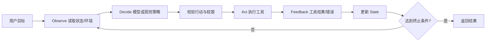
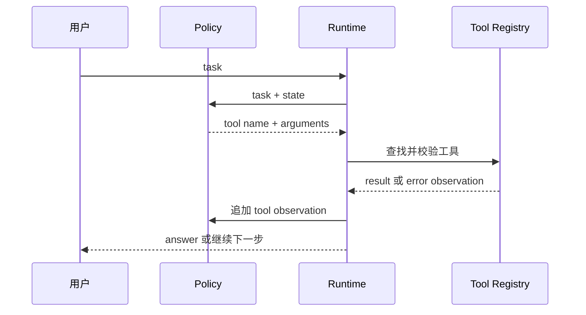

# 第 1 章：初识智能体

## 1. 本章定位

- Hello-Agents 原章节：第 1 章“初识智能体”
- 当前状态：🔁 已学基础，继续深入
- `achieve` 对应：第 1～3 课
- 实践项目：[01-agent-basics](../projects/01-agent-basics/README.md)

这不是把旧项目复制一遍，而是用旧项目已经学过的内容作起点，重新建立一个完整的 Agent 心智模型：普通 LLM 调用负责“一问一答”，Agent 则负责围绕目标持续观察、决策、行动、接收反馈，并在满足终止条件时交付结果。

## 2. 学习目标

完成本章后，你应该能够：

1. 用自己的话解释 LLM、Workflow 和 Agent 的边界；
2. 画出 Observe → Decide → Act → Feedback 的闭环；
3. 说明 Model、Goal、Tool、State、Environment、Policy、Runtime 的职责；
4. 解释模型为什么只能“建议”工具调用，不能直接获得程序权限；
5. 用 Python 写出一个有工具、状态、最大步数和错误回传的最小 Agent；
6. 在离线规则模式和真实 LLM 模式之间切换；
7. 为未知工具、非法参数、工具异常和 Agent 死循环写测试。

## 3. 先回顾 achieve 第 1～3 课

旧路线已经完成了三次递进：

| 旧课 | 已掌握内容 | 本章如何继续深入 |
|---|---|---|
| 第 1 课 | 调用 OpenAI 兼容模型，理解 messages | 把模型调用封装成可替换的决策组件 |
| 第 2 课 | 从 `input()` 获取用户任务，注册加法/乘法工具 | 把工具注册表、参数 schema 和安全执行边界显式化 |
| 第 3 课 | 多步调用、最大步数、错误回传 | 把每一步状态和事件保存成可测试结果，并比较规则 Agent 与 LLM Agent |

旧项目的代码可以帮助你复习，但新项目不从 `achieve/` 导入任何 Python 模块。

## 4. Agent 到底是什么

一个实用定义是：Agent 是一个能够感知环境、根据目标选择行动、执行行动并利用反馈继续推进任务的系统。这里的“智能”不只在模型里，完整能力来自四部分：

- 模型或策略：根据当前上下文提出答案或行动建议；
- 工具：把建议连接到计算、检索、文件、数据库等外部能力；
- 状态：保存任务、历史消息、中间结果、错误和预算；
- 运行时：控制循环、权限、重试、超时、终止和观测。

因此，一次 `client.chat.completions.create()` 只是模型调用，不自动成为 Agent。只有当系统把模型输出解释为行动、执行行动、把观察结果放回状态并继续决策时，才形成 Agent 闭环。



## 5. 七个核心组成部分

### 5.1 Model：负责理解和生成建议

Model 接收 system、user、assistant、tool 消息，输出文本或结构化工具调用。模型可能产生错误名称、错误参数、重复行动或幻觉，因此它不是权限边界。真实调用使用 `OPENAI_BASE_URL`、`OPENAI_API_KEY`、`OPENAI_MODEL` 配置；API Key 只存在本地 `.env`，不写进代码、日志或测试。

### 5.2 Goal：定义“完成”

“回答问题”太模糊，最好变成可判断的目标，例如“得到一个数字结果”“生成一份带引用的报告”“完成审批前的草案”。没有明确 Goal，Agent 可能在看似合理的循环中一直工作。

### 5.3 Tool：连接外部世界

工具至少需要名称、描述、输入 schema、实现和错误语义。工具调用路径应该是：模型提出名称与参数 → 程序查注册表 → 程序校验参数 → 程序执行 → 把 observation 返回给模型。模型永远不应该直接执行 Python 代码或自由访问文件系统。

### 5.4 State：让行动连续

本章的状态包含用户任务、消息、已调用工具、工具观察和当前答案。状态不是“模型内部记忆”，而是程序可以检查、保存、恢复和测试的数据。多步 Agent 的关键变化，就是下一步的输入包含上一步的结果。

### 5.5 Environment：行动发生的地方

环境可以是本地计算函数、知识库、浏览器、业务 API 或真实世界。离线 Demo 使用确定性算术工具模拟环境；生产环境还必须考虑网络失败、权限、数据变化、幂等和副作用。

### 5.6 Policy：决定下一步

Policy 可以是规则、LLM、搜索算法或它们的组合。离线模式的 Policy 只解析课程用的中文算术任务；真实模式让 LLM 选择工具，但两种 Policy 都输出相同的 AgentResult，方便替换和测试。

### 5.7 Runtime：控制系统边界

Runtime 负责最大步数、未知工具拒绝、参数校验、异常隔离、超时、预算和日志。本章的 `run_actions()` 和 `run_llm()` 就是一个极小的 Runtime。它们把工具异常转换成 observation，而不是让整个进程无诊断地崩溃。

## 6. Workflow、Chatbot 和 Agent 的区别

| 类型 | 下一步由谁决定 | 是否动态选择行动 | 适合场景 |
|---|---|---|---|
| 普通 LLM 调用 | 调用方代码 | 否 | 总结、改写、单次问答 |
| Workflow | 预先写好的节点图 | 只在预设分支中选择 | 稳定业务流程、审批 |
| Agent | 模型/策略结合运行时 | 是，但受工具和策略约束 | 开放问题、逐步研究、工具协作 |

Agent 并不一定优于 Workflow。能用确定节点表达的流程，优先使用 Workflow；只有当下一步需要根据观察结果动态决定时，才引入 Agent。

## 7. 本项目代码怎么流转



代码文件职责如下：

- `agent.py`：工具函数、工具 schema、工具注册表、离线 Policy 和安全执行；
- `llm_agent.py`：真实 OpenAI 兼容 tool-calling 循环；
- `main.py`：命令行入口，只负责选择模式和打印结果；
- `common/llm.py`：读取环境配置，不打印 API Key；
- `tests/test_agent_basics.py`：第一课专属行为测试。

一次离线任务“先计算 8 加 4，再把结果乘以 3”的状态变化是：

```text
初始状态：task，尚无结果
第 1 步：add_numbers(8, 4) → observation=12.0
第 2 步：multiply_numbers(12.0, 3) → observation=36.0
终止：返回 36.0
```

## 8. 为什么必须有最大步数和错误回传

模型可能重复请求同一个工具、无法理解错误，或者在工具结果不完整时继续循环。`max_steps` 是最后一道保险，不能只依赖 system prompt。工具错误返回为 observation 后，模型可以解释“除数不能为 0”；如果直接抛出异常，用户只会看到程序失败，也失去进一步决策的机会。

但错误回传不代表要吞掉所有异常。生产系统应区分：可恢复的业务错误、需要重试的临时错误、必须终止的权限错误，以及需要报警的程序错误。本课用统一字符串是为了展示机制，后续课程会进一步学习结构化错误和可靠工具执行。

## 9. 运行本课

```bash
cd /Users/yibo.chen/project/agents-learning/hello-agents

# 离线两步 Agent，不访问网络
python projects/01-agent-basics/main.py --demo

# 自定义离线任务
python projects/01-agent-basics/main.py --demo --task "12 乘以 8"
python projects/01-agent-basics/main.py --demo --task "10 除以 0"

# 真实 LLM Agent；先准备本项目自己的 .env
cp .env.example .env
python projects/01-agent-basics/main.py --llm --task "请计算 23 加 19"

# 第一课测试
python -m unittest hello-agents/tests/test_agent_basics.py -v
```

真实 LLM 模式中，LLM 只负责选择工具和参数，Python 负责注册表查找、参数校验、工具执行和错误回传。若网关的思考模式不支持当前 `tool_choice`，应先调整模型/网关配置，不能把工具执行改成模型自由生成的结果。

## 10. 动手实验

### 实验 A：增加一个工具

实现 `subtract_numbers(a, b)`，补充 `TOOLS` schema、注册表和 `parse_offline_actions()`。要求未知工具测试仍然通过，并新增一个专属测试。

### 实验 B：观察状态依赖

把“先加再乘”的第二步改成固定使用原始输入，比较结果；然后恢复为使用第一步 observation。用自己的话解释为什么第二步必须依赖状态，而不是只依赖原始 user message。

### 实验 C：改变最大步数

将两步任务的 `max_steps` 改为 1，观察 `MaxStepsExceeded`；再将它改回 5。思考：真实系统除了步数，还应该限制什么资源？答案至少包括 token、金额、总时长和工具调用次数。

### 实验 D：加入结构化事件

为每次工具调用增加 `step`、`tool`、`arguments`、`observation` 和 `duration_ms` 字段，但禁止记录 API Key。事件日志应该能回答“发生了什么”，而不是泄漏“调用凭证是什么”。

## 11. 常见错误

- 把 `tool_calls` 当成最终答案：工具调用只是模型提出的行动建议；
- 直接执行模型传来的任意函数名：必须从白名单注册表查找；
- 不校验参数：JSON 合法不代表业务参数合法；
- 没有 tool message：模型看不到工具结果，就无法进行下一步；
- 没有最大步数：模型重复行动会造成无限循环和费用失控；
- 把离线规则 Demo 伪装成真实 Agent：Demo 的策略是固定规则，必须在输出和文档中明确；
- 把模型自述的来源当证据：来源必须来自真实检索器或可信业务数据。

## 12. 本章验收

- [ ] 能解释普通 LLM、Workflow 和 Agent 的区别；
- [ ] 能画出 Observe → Decide → Act → Feedback；
- [ ] 能指出 `agent.py` 中工具 schema、注册表、执行器和状态结果的位置；
- [ ] `--demo` 能完成两步算术任务；
- [ ] 除零返回可读 observation，未知工具被拒绝；
- [ ] 最大步数能阻止超长动作序列；
- [ ] `--llm` 使用 OpenAI 兼容接口，密钥只从环境读取；
- [ ] 第一课专属测试全部通过；
- [ ] 完成至少两个实验，并记录改动前后的轨迹。

完成这些项目后，才算完成第一课；仅仅看到一次模型回答，不代表掌握了 Agent。
