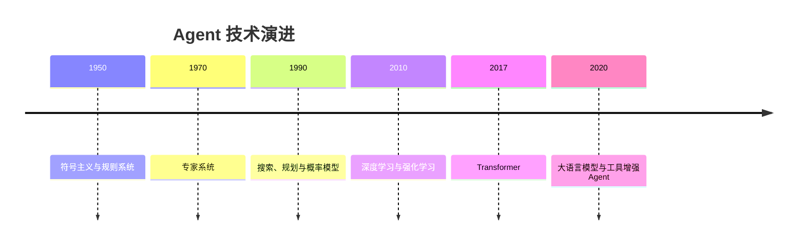

# 第 2 章：智能体发展史

## 学习状态

- 状态：🆕 未学习；`achieve/` 没有按历史脉络系统整理。
- 原项目章节：Hello-Agents 第 2 章。
- 实践项目：[02-agent-history](../projects/02-agent-history/README.md)。

## 先修与目标

本章只要求理解第 1 章的 Agent 定义。目标不是背年代，而是理解“规则、搜索、概率模型、强化学习、基础模型”分别解决了什么问题，以及为什么今天的 Agent 仍然把它们组合起来。

符号主义系统把知识写成规则，优点是可解释，缺点是难以覆盖开放世界。经典规划把任务表示为状态、动作和目标，用搜索找到动作序列；机器学习让系统从数据中拟合规律；强化学习通过奖励改善策略；Transformer 和大语言模型则把自然语言理解、生成和工具规划带到同一接口中。LLM Agent 并不是凭空出现的“会思考的人”，而是模型、记忆、工具、策略和运行时的工程组合。

## 关键理解

1. 能力提升通常来自表示方式和反馈信号的变化，而非简单堆叠模型参数。
2. 可解释性、泛化、成本、实时性之间始终存在取舍；生产系统往往用规则兜底，用模型处理开放输入。
3. “自主”不是无限权限。现代 Agent 必须保留边界、审批、超时和审计。

## 实践与验收

运行 `python main.py --demo` 查看同一任务在规则、搜索和 LLM 风格策略下的轨迹。实验：新增一个历史阶段；为每种范式写一个失败案例；比较“固定规则”和“可学习策略”在未知输入上的行为。验收时应能解释每个阶段的输入、输出和主要限制，并说明为什么当前系统常用混合架构。
