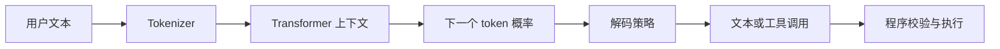

# 第 3 章：大语言模型基础

## 学习状态

- 状态：🔁 已学基础，继续深入；`achieve` 第 1 课已经使用聊天模型，但没有系统解释其内部工作方式。
- 原项目章节：Hello-Agents 第 3 章。
- 实践项目：[03-llm-foundation](../projects/03-llm-foundation/README.md)。

## 核心内容

语言模型把文本切成 token，经过 embedding、Transformer 的注意力和前馈层，预测下一个 token 的概率。一次回答本质是不断采样或选择下一个 token。上下文窗口决定一次请求能放多少输入和输出；参数量、训练数据和推理策略影响能力，但都不能保证事实正确。

在 Agent 中要区分四层：消息协议（system/user/assistant/tool）、提示词模板、模型适配器、业务状态。温度、最大输出 token、工具选择和结构化输出是推理控制项，不应散落在业务节点里。模型输出是“不可信的建议”，解析、校验和权限检查必须由程序完成。

## 与 achieve 的边界

回顾第 1 课的 OpenAI 兼容接口、网关和环境变量；新增 token、上下文窗口、采样、幻觉、提示注入和结构化解析。真实接口建议使用 `OPENAI_BASE_URL`、`OPENAI_API_KEY`、`OPENAI_MODEL`，并且永远不要把密钥写进日志、测试或课程材料。

## 实践与验收

Demo 会展示 token 估算、消息拼接和一次确定性“模型响应”。实验：改变 system 指令；截断历史消息；让模型输出 JSON 后进行 schema 校验。验收：能说明模型为什么会生成“internal knowledge”这类自述性来源、为什么不能把它当作真实检索证据，以及模型失败时应该在哪一层重试或降级。
