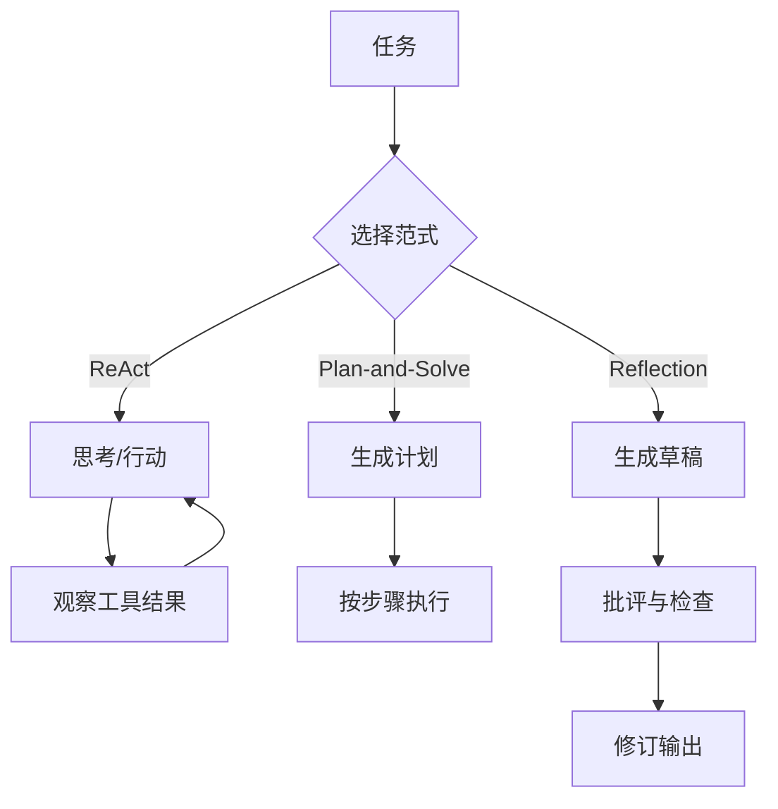

# 第 4 章：ReAct、Plan-and-Solve 与 Reflection

## 学习状态

- 状态：🔁 已学基础；对应 `achieve` 第 3、17、20 课，本章比较三种经典范式。
- 原项目章节：Hello-Agents 第 4 章。
- 实践项目：[04-agent-patterns](../projects/04-agent-patterns/README.md)。

## 三种范式

ReAct 把推理和行动交替进行：模型提出当前行动，工具返回观察，再决定下一步；它适合信息逐步揭示的任务。Plan-and-Solve 先生成计划，再逐项执行，适合步骤稳定、需要提前分解的任务，但计划可能在第一步就过时。Reflection 在得到草稿或失败轨迹后，让另一个步骤检查问题并修订，适合质量优先的输出，但会增加时延和成本。

## 设计取舍

不要把“思考文本”当成安全控制。程序真正需要保存的是 action、tool_input、observation、error 和 step；可见解释可以单独做摘要。每个范式都要有最大步数、循环检测、工具超时和终止条件。复杂应用可把三者组合成“先计划、局部 ReAct、最后 Reflection”。

## 实践与验收

运行 Demo 比较三种轨迹。实验：让计划在中途失效并触发重规划；加入重复行动检测；把 Reflection 改成基于规则的质量检查。验收时应能根据任务特征选择范式，并说清状态如何从一个阶段流向另一个阶段。
