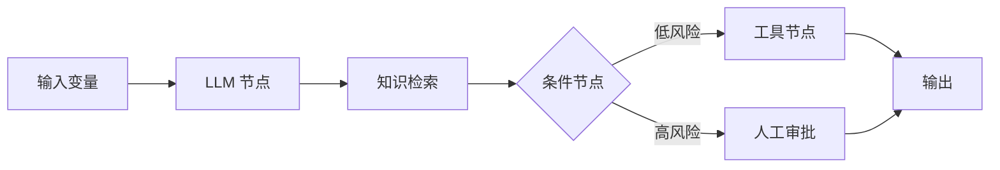

# 第 5 章：Coze、Dify 与 n8n 低代码平台

## 学习状态

- 状态：🔁 已学基础；此前讨论过 Dify 的节点、状态和流程编排，本章把它们与代码实现对齐。
- 原项目章节：Hello-Agents 第 5 章。
- 实践项目：[05-low-code-platforms](../projects/05-low-code-platforms/README.md)。

## 三层实现标准

- 概念层：理解 Coze、Dify、n8n 的定位，以及节点、边、状态、条件、审批和 Runtime 的关系。
- 最小实践层：用 Python 字典模拟输入、规范化、路由和输出节点，观察每次状态更新。
- 工程实现层：实现带输入输出 schema 的 Node/State 接口、条件路由、人工审批暂停恢复、持久化、幂等和节点级测试；必要时再接入真实平台 API。

当前仓库已经把三层串起来：`main.py` 保留最小字典 Demo，`workflow.py` 提供工程层的节点 schema、状态持久化、审批暂停/恢复和幂等；它仍是教学用小型工作流，不是完整低代码平台。

## 统一抽象

低代码平台通常把应用拆为输入、模型、知识库、工具、条件分支、循环、人工审批和输出节点。节点的输入来自变量或上游状态，节点输出写回状态并触发下游。Dify 更偏 LLM 应用和工作流，Coze 更偏 Bot、插件和发布生态，n8n 更偏跨系统自动化；具体产品能力会随版本变化，应以官方文档为准。



低代码的价值是缩短编排和交付时间，不等于消除了软件工程：仍要设计 schema、权限、幂等、重试、观测和版本管理。尤其要注意变量名漂移、隐式上下文、循环没有上限、凭证被拼进提示词，以及平台导出配置中的密钥。

## 实践与验收

Demo 用 Python 字典模拟节点图，并输出每个节点的输入输出；工程实现使用 `NodeSpec`、`WorkflowState`、`WorkflowRunner` 和 `SQLiteStateStore` 把节点输入、状态、路由和恢复显式化，同时加入 `chat`、`failed`、耗时、审批超时和权限工具节点。验收：能把平台上的一个节点映射到“函数 + 输入 schema + 输出 schema + 状态更新”，能解释暂停恢复、幂等和失败状态，并指出哪些逻辑应该留在平台、哪些必须进入可测试代码。

工程层运行示例：

```bash
python projects/05-low-code-platforms/main.py --demo
python projects/05-low-code-platforms/main.py --demo \
  --question "请发送邮件给客户" --state-file /tmp/hello-agents-workflow.json
python projects/05-low-code-platforms/main.py --demo \
  --question "请发送邮件给客户" --resume --approve \
  --state-file /tmp/hello-agents-workflow.json
python -m unittest hello-agents/tests/test_low_code_workflow.py -v
```
