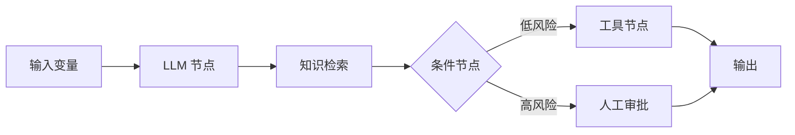

# 第 5 章：Coze、Dify 与 n8n 低代码平台

## 学习状态

- 状态：🔁 已学基础；此前讨论过 Dify 的节点、状态和流程编排，本章把它们与代码实现对齐。
- 原项目章节：Hello-Agents 第 5 章。
- 实践项目：[05-low-code-platforms](../projects/05-low-code-platforms/README.md)。

## 统一抽象

低代码平台通常把应用拆为输入、模型、知识库、工具、条件分支、循环、人工审批和输出节点。节点的输入来自变量或上游状态，节点输出写回状态并触发下游。Dify 更偏 LLM 应用和工作流，Coze 更偏 Bot、插件和发布生态，n8n 更偏跨系统自动化；具体产品能力会随版本变化，应以官方文档为准。

低代码的价值是缩短编排和交付时间，不等于消除了软件工程：仍要设计 schema、权限、幂等、重试、观测和版本管理。尤其要注意变量名漂移、隐式上下文、循环没有上限、凭证被拼进提示词，以及平台导出配置中的密钥。

## 实践与验收

Demo 用 Python 字典模拟节点图，并输出每个节点的输入输出。实验：新增审批节点；把固定顺序改成条件分支；把一段工作流映射为代码状态机。验收：能把平台上的一个节点映射到“函数 + 输入 schema + 输出 schema + 状态更新”，并指出哪些逻辑应该留在平台、哪些必须进入可测试代码。
