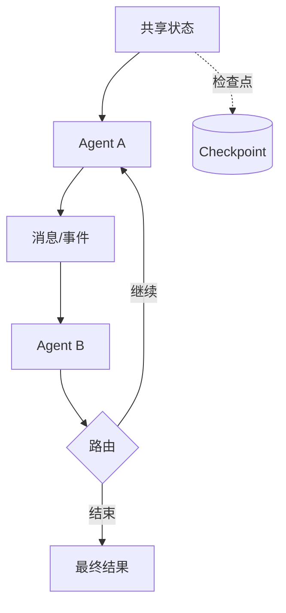

# 第 6 章：AutoGen、AgentScope 与 LangGraph

## 学习状态

- 状态：🔁 已学基础；对应 `achieve` 第 23～26 课，新增 AutoGen 与 AgentScope 的对比视角。
- 原项目章节：Hello-Agents 第 6 章。
- 实践项目：[06-agent-frameworks](../projects/06-agent-frameworks/README.md)。

## 框架比较方法

不要先比较 API 名称，应先比较四个问题：谁持有状态、谁决定下一步、消息如何传递、失败如何恢复。AutoGen 常以多 Agent 对话和消息协作为核心；AgentScope 强调 Agent、消息和运行时的工程化组织；LangGraph 把状态图、节点、边、检查点和中断显式化。版本和接口会变化，学习重点是可迁移的抽象。

多 Agent 并不自动带来更好结果。角色边界、消息格式、终止条件和成本预算必须显式定义；对能用一个确定函数完成的任务，不要使用对话式多 Agent。框架层也不应替代业务层的权限和数据校验。

## 实践与验收

Demo 用同一状态图模拟三种框架的核心模型。实验：把串行协作改成并行后合并；加入失败重试和检查点；记录每个 Agent 的 token 与耗时。验收：能画出状态、消息和路由关系，能解释框架选择依据，并知道如何在框架升级时保护自己的业务接口。
