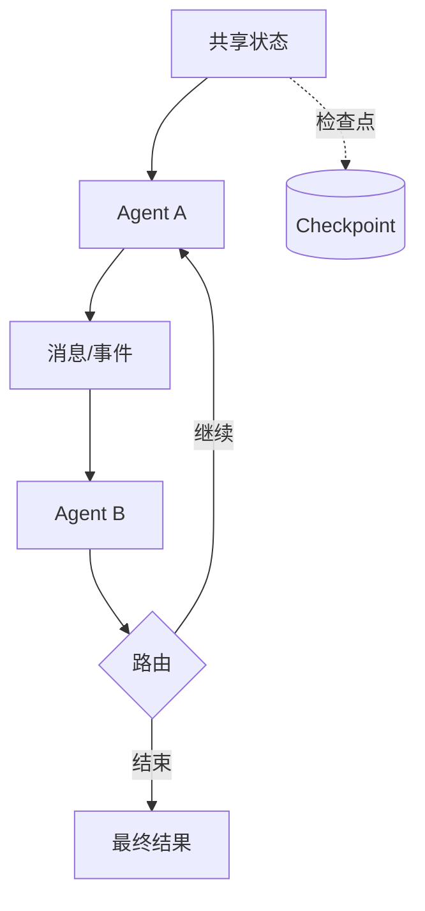

# 第 6 章：AutoGen、AgentScope 与 LangGraph

## 学习状态

- 状态：✅ 已完成（2026-08-24）；对应 `achieve` 第 23～26 课，新增 AutoGen、AgentScope 与 LangGraph 的对比视角。
- 原项目章节：Hello-Agents 第 6 章。
- 实践项目：[06-agent-frameworks](../projects/06-agent-frameworks/README.md)。

## 三层实现标准

- 概念层：比较 AutoGen、AgentScope、LangGraph 的状态、消息、路由、检查点和失败恢复模型。
- 最小实践层：用标准库状态图模拟 Agent 协作、消息传递和检查点。
- 工程实现层：选择至少一个框架或实现兼容适配层，完成多 Agent 协作、并行/汇总、检查点恢复、超时、成本观测和集成测试；框架版本以当前官方文档为准。

当前仓库同时保留两条路径：`frameworks.py` 提供三层的框架无关实现，适合离线学习；`integrations/` 提供官方 SDK 适配器，适合真实 LLM 和框架验证。两条路径共享异步消息、事件、异常和 Runtime 边界，不会把离线 Demo 替换掉。

## 框架比较方法

不要先比较 API 名称，应先比较四个问题：谁持有状态、谁决定下一步、消息如何传递、失败如何恢复。AutoGen 常以多 Agent 对话和消息协作为核心；AgentScope 强调 Agent、消息和运行时的工程化组织；LangGraph 把状态图、节点、边、检查点和中断显式化。版本和接口会变化，学习重点是可迁移的抽象。



多 Agent 并不自动带来更好结果。角色边界、消息格式、终止条件和成本预算必须显式定义；对能用一个确定函数完成的任务，不要使用对话式多 Agent。框架层也不应替代业务层的权限和数据校验。

## 实践与验收

Demo 用同一 Runtime 模拟三种框架的核心模型。工程实现增加了串行/并行两种运行方式、SQLite checkpoint、恢复、失败状态、超时、token 用量和节点事件。实验：把串行协作改成并行后合并；从 checkpoint 恢复；模拟 Agent 失败和超时；记录每个 Agent 的 token 与耗时。验收：能画出状态、消息和路由关系，能解释框架选择依据，并知道如何在框架升级时保护自己的业务接口。

运行离线和异步路径：

```bash
python projects/06-agent-frameworks/main.py --demo
python projects/06-agent-frameworks/main.py --parallel
python projects/06-agent-frameworks/main.py --fail
python projects/06-agent-frameworks/main.py --adapter offline --query "解释 Agent 状态"
python projects/06-agent-frameworks/main.py --adapter offline --stream
python -m unittest hello-agents/tests/test_agent_frameworks.py -v
```

官方适配器按需安装：

```bash
python -m pip install -r hello-agents/requirements-autogen.txt
python -m pip install -r hello-agents/requirements-agentscope.txt
python -m pip install -r hello-agents/requirements-langgraph.txt
```

这三个依赖建议使用独立虚拟环境；详见项目 README。真实模式的统一配置是 `OPENAI_API_KEY`、`OPENAI_BASE_URL` 和 `OPENAI_MODEL`，默认测试不联网。

本课新增的工程能力可以按以下顺序验证：

1. `--adapter openai` 验证 OpenAI-compatible 异步调用；
2. 加 `--stream` 观察 Runtime 生命周期和模型 delta 事件；
3. `--adapter autogen`、`agentscope` 对比两个官方 Agent 抽象；
4. `--adapter langgraph --interrupt` 观察 `interrupt()` 暂停，再用 `--approval approved` 在同一进程演示 `Command(resume=...)`；
5. 用 `--timeout-seconds` 和 `--max-attempts` 观察超时、重试事件；用 Runtime API 的 `cancel(task)` 验证 cancelled checkpoint。

LangGraph Demo 使用内存 checkpoint，只适合课程演示；跨进程生产恢复需要持久化 checkpointer 和稳定 thread id。真实 smoke test 必须显式设置 `RUN_REAL_AGENT_SMOKE=1`，可能产生模型费用。
