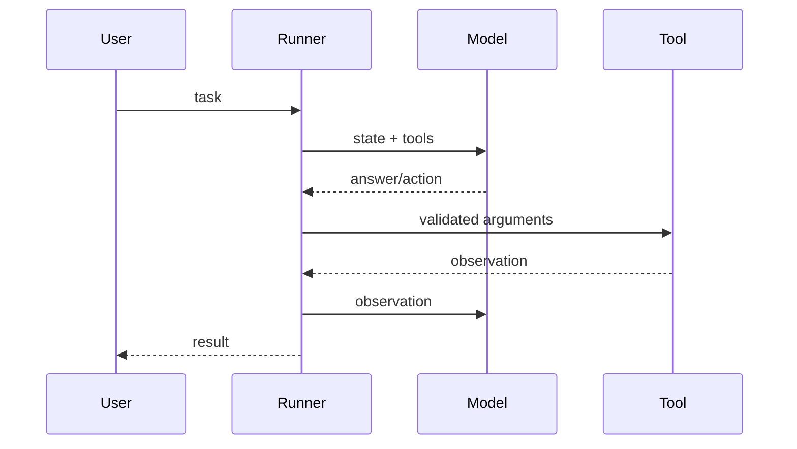

# 第 7 章：从零构建 Agent 框架

## 学习状态

- 状态：🔁 已学基础；第 1～3 课已有循环原理，本章把隐含逻辑抽成可替换组件。
- 原项目章节：Hello-Agents 第 7 章。
- 实践项目：[07-build-agent-framework](../projects/07-build-agent-framework/README.md)。

## 最小内核

一个可教学的 Mini Agent Framework 至少包含 `Model`、`Tool`、`Memory`、`Policy` 和 `Runner`。Model 只负责请求与响应；Tool 负责受控副作用；Policy 把模型输出解释成最终答案或工具调用；Runner 负责循环、步数、异常和事件；Memory 负责保存可恢复的消息。接口清晰后，可以在不改 Runner 的情况下替换规则模型或真实 LLM。

边界条件是框架的核心教材：模型输出格式错误时不能执行；工具失败时只在允许的错误上重试；达到步数上限要返回可诊断结果；事件日志不能包含密钥。框架越小，越适合先用单元测试证明这些不变量。

## 实践与验收

运行 Demo 创建一个加法工具和一个规则模型。实验：新增工具 schema 校验；替换模型实现；让工具第二次调用失败并观察重试。验收：能独立说明一次运行中每个组件的职责，并能为“最大步数、未知工具、非法参数、工具异常”各写一个测试。
