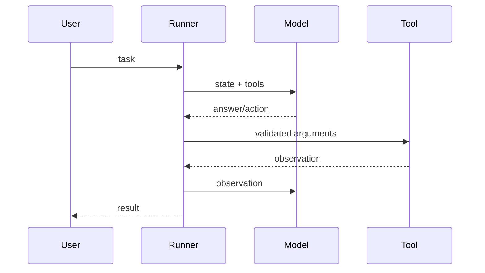

# 第 7 章：从零构建 Agent 框架

## 学习状态

- 状态：✅ 已完成（2026-08-24）；第 1～3 课已有循环原理，本章把隐含逻辑抽成可替换组件。
- 原项目章节：Hello-Agents 第 7 章。
- 实践项目：[07-build-agent-framework](../projects/07-build-agent-framework/README.md)。

## 三层实现标准

- 概念层：理解 Model、Tool、Memory、Policy、Runner 的接口边界和依赖方向。
- 最小实践层：用规则模型、工具注册表和有上限的 Runner 完成一个可读的 Mini Framework。
- 工程实现层：拆分可安装模块，加入结构化消息、schema 校验、插件注册、持久化检查点、事件观测、错误分类和完整测试，并验证真实 LLM 适配器可替换。

当前代码已经覆盖三层：`main.py` 保留压缩版 Demo，`mini_agent/` 提供工程层实现。工程层的重点是接口稳定性，而不是简单增加更多工具函数。

## 最小内核

一个可教学的 Mini Agent Framework 至少包含 `Model`、`Tool`、`Memory`、`Policy` 和 `Runner`。Model 只负责请求与响应；Tool 负责受控副作用；Policy 把模型输出解释成最终答案或工具调用；Runner 负责循环、步数、异常和事件；Memory 负责保存可恢复的消息。接口清晰后，可以在不改 Runner 的情况下替换规则模型或真实 LLM。



边界条件是框架的核心教材：模型输出格式错误时不能执行；工具失败时只在允许的错误上重试；达到步数上限要返回可诊断结果；事件日志不能包含密钥。框架越小，越适合先用单元测试证明这些不变量。

## 实践与验收

运行旧 Demo：

```bash
python projects/07-build-agent-framework/main.py --demo
```

运行工程版离线 Agent：

```bash
python projects/07-build-agent-framework/main.py \
  --framework-demo \
  --query "计算 4 + 5"
```

运行真实 LLM Agent：

```bash
python projects/07-build-agent-framework/main.py \
  --llm-agent \
  --query "计算 4 + 5"
```

工程实现由以下组件组成：

```text
Model → Policy → Runner → ToolRegistry → Tool
             ↑       ↓
           Memory ← Observation
```

- `Model`：产生结构化响应或 JSON 文本；
- `Policy`：严格解析 `final` 和 `tool_call`；
- `ToolRegistry`：注册工具、校验参数、检查权限；
- `Memory`：保存消息、观察结果、事件和运行状态；
- `Runner`：控制循环、最大步数、错误、重试和 checkpoint。

验收：能独立说明一次运行中每个组件的职责，并能为“最大步数、未知工具、非法参数、权限拒绝、工具异常、checkpoint 恢复”各写一个测试。
