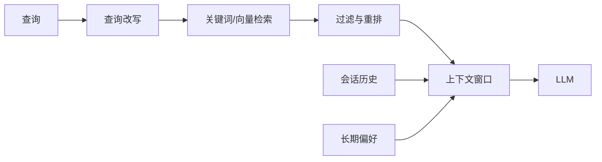

# 第 8 章：Memory 与 RAG

## 学习状态

- 状态：✅ 已学过基础；对应 `achieve` 第 4～16 课，本章把短期记忆、长期记忆和检索增强统一起来。
- 原项目章节：Hello-Agents 第 8 章。
- 实践项目：[08-memory-and-rag](../projects/08-memory-and-rag/README.md)。

## 三层实现标准

- 概念层：区分短期记忆、长期记忆、外部知识库、分块、召回、重排和引用。
- 最小实践层：用固定文档和关键词检索展示记忆读取、top-k 和来源返回。
- 工程实现层：实现可替换的 Memory/Retriever 接口，补充文件或数据库持久化、向量检索、租户隔离、删除策略、引用校验、缓存和检索评测；离线关键词检索继续保留。

当前 Demo 只验证检索主流程，不能代表生产级向量数据库和记忆治理已经完成。

## 三种“记忆”

短期记忆是当前会话消息和工具观察，决定模型眼前能看到什么；长期记忆是跨会话保存的用户偏好、事实或经验；外部知识库是可更新的文档集合，通常通过 RAG 在请求时检索，而不是把所有内容永久塞进 prompt。三者的生命周期、权限和删除策略不同，不能混成一个列表。

RAG 的质量来自分块、召回、去重、重排、引用和回答约束的整体组合。记忆写入前应判断是否稳定、有用、允许保存；读取时应按用户和租户隔离。缓存不能替代事实来源，模型自称“internal knowledge”也不能当引用。

## 实践与验收

Demo 提供内存会话、文件知识和关键词检索。实验：增加向量相似度接口；让相同问题分别只读短期记忆和长期记忆；加入来源编号和“证据不足”分支。验收：能解释检索结果如何进入上下文，以及为什么记忆写入、读取、删除都需要独立策略。
