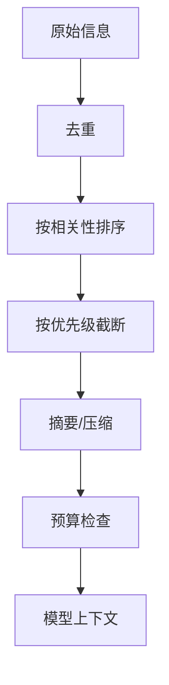

# 第 9 章：上下文工程

## 学习状态

- 状态：🔁 已学基础；对应 `achieve` 第 16、22 课，本章从“压缩历史”扩展到上下文系统设计。
- 原项目章节：Hello-Agents 第 9 章。
- 实践项目：[09-context-engineering](../projects/09-context-engineering/README.md)。

## 三层实现标准

- 概念层：理解上下文选择、排序、压缩、预算、优先级和提示注入边界。
- 最小实践层：用固定条目和 token 成本模拟优先级选择与预算截断。
- 工程实现层：接入真实 token 计数，建立消息分层、摘要存储、敏感字段过滤、注入检测、预算/成本监控和长会话回归测试。

工程实现已补齐上下文编译、Token 计数、摘要存储、脱敏、注入检测和成本预算；它仍然是教学级实现，必须通过回归测试证明压缩不会丢失任务约束、来源和未完成事项。

## 上下文不是聊天记录

上下文是某一轮决策真正需要的信息集合。它包括任务目标、当前状态、约束、工具说明、相关证据、最近观察和输出格式。长对话全部拼接会造成 token 浪费、注意力稀释和旧指令污染，因此需要选择、排序、压缩和验证。

实用原则是“先保证任务和安全约束，再放高相关证据，最后放低优先级历史”。摘要必须保留实体、数字、未完成事项和来源；压缩后要能追溯原文。预算不仅是 token 数，也包括延迟、金额和模型上下文上限。对提示注入要把外部文本标为数据，不得让它覆盖系统策略。

## 实践与验收

Demo 用优先级队列生成固定预算上下文。工程实现位于 `projects/09-context-engineering/context_engine/`，包括：

- `ContextBuilder`：必选安全约束/当前任务优先，按优先级、相关性、新鲜度选择可选项；
- `TokenCounter`：优先使用 `tiktoken`，编码表不可用时显式降级；
- `SensitiveDataFilter`：脱敏 API Key、Authorization、Cookie、密码和 Token；
- `PromptInjectionDetector`：将外部指令标记为不可信数据；
- `SQLiteSummaryStore`：保存摘要及来源 ID；
- `CostMonitor`：计算输入/输出成本，调用前执行预算门禁。

实验：改变 `--budget` 观察信息淘汰；比较必选约束和旧历史的优先级；查看 `redacted_fields` 与 `injection_warnings`；用 `--cost-budget-usd` 触发成本门禁。验收：能说明一个字段为何被选中、被截断或被脱敏，并能计算一次运行的 Token 和成本预算。
