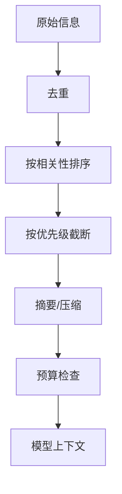

# 第 9 章：上下文工程

## 学习状态

- 状态：🔁 已学基础；对应 `achieve` 第 16、22 课，本章从“压缩历史”扩展到上下文系统设计。
- 原项目章节：Hello-Agents 第 9 章。
- 实践项目：[09-context-engineering](../projects/09-context-engineering/README.md)。

## 上下文不是聊天记录

上下文是某一轮决策真正需要的信息集合。它包括任务目标、当前状态、约束、工具说明、相关证据、最近观察和输出格式。长对话全部拼接会造成 token 浪费、注意力稀释和旧指令污染，因此需要选择、排序、压缩和验证。

实用原则是“先保证任务和安全约束，再放高相关证据，最后放低优先级历史”。摘要必须保留实体、数字、未完成事项和来源；压缩后要能追溯原文。预算不仅是 token 数，也包括延迟、金额和模型上下文上限。对提示注入要把外部文本标为数据，不得让它覆盖系统策略。

## 实践与验收

Demo 用优先级队列生成固定预算上下文。实验：改变预算观察信息淘汰；保留最近消息但压缩旧消息；加入来源和敏感字段过滤。验收：能说明一个字段为何被选中、被截断或被脱敏，并能计算一次运行的 token 预算。
