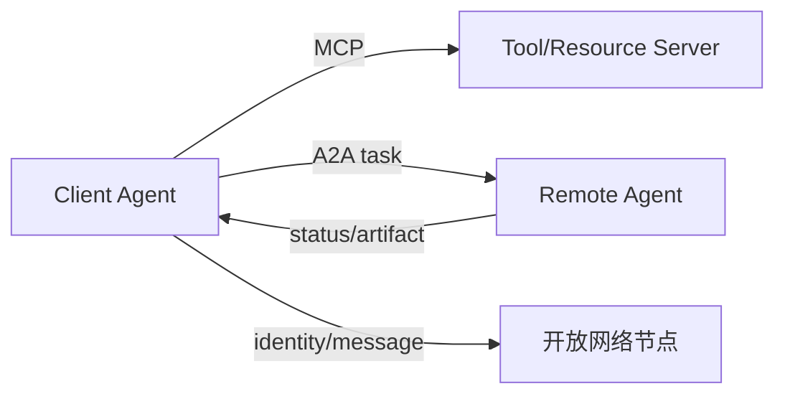

# 第 10 章：MCP、A2A 与 ANP

## 学习状态

- 状态：🔁 已学基础；对应 `achieve` 第 23 课，本章扩展到工具协议和 Agent 间通信。
- 原项目章节：Hello-Agents 第 10 章。
- 实践项目：[10-agent-protocols](../projects/10-agent-protocols/README.md)。

## 三类边界

MCP 主要解决模型或 Agent 如何发现并调用外部工具、资源和提示；A2A 关注不同 Agent 之间如何发现能力、委派任务、传递状态和返回结果；ANP 常被用来讨论开放网络中的 Agent 身份与通信。名称和规范会演进，使用时应以对应官方协议版本为准。共同点是把“隐式 Python 调用”变成有 schema、有错误码、有生命周期的通信。

协议不等于信任。服务发现后仍要做身份认证、能力授权、参数校验、超时、重放保护和审计。长任务要有 task id、状态查询、取消和幂等语义；文件和 URL 不能未经限制直接交给远端服务。

## 实践与验收

Demo 定义一个最小 tool manifest 和一个 Agent task envelope，在本地完成发现、调用、状态更新和错误返回。实验：加入版本字段；模拟超时和重复请求；拒绝未授权工具。验收：能区分工具协议与 Agent 协议，并能说清一次远程任务的身份、权限、状态和结果路径。
