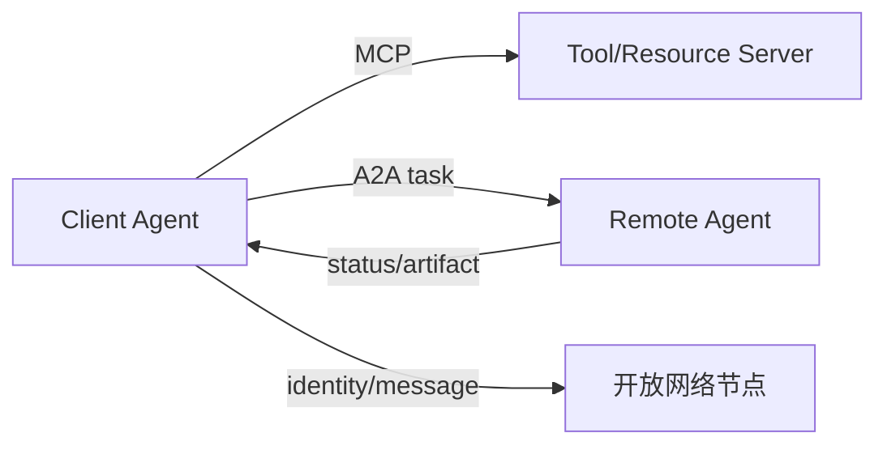
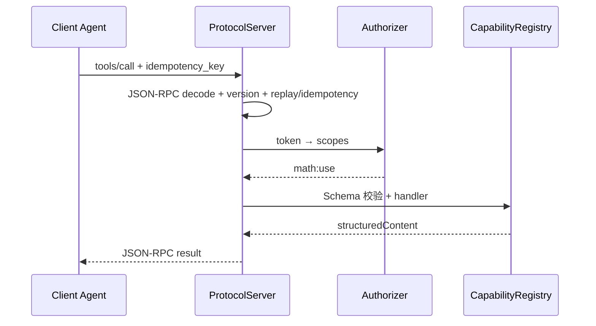
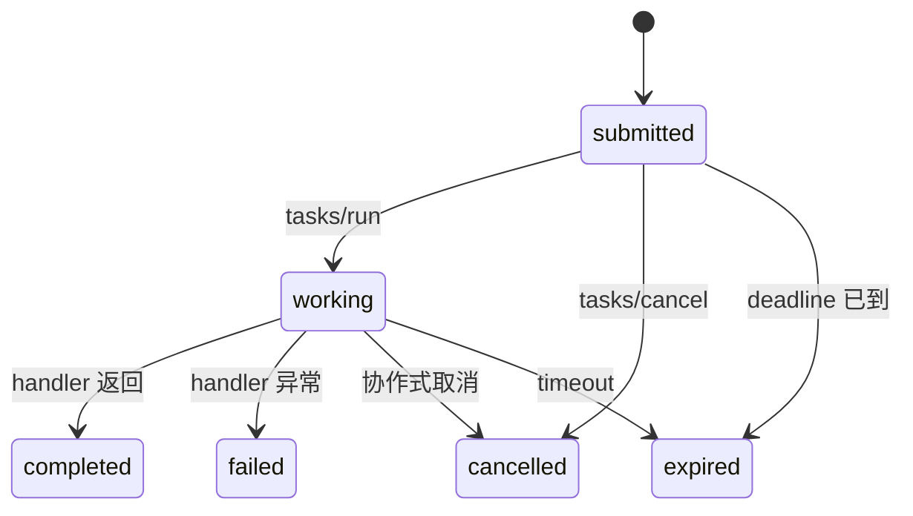

# 第 10 章：MCP、A2A 与 ANP

## 学习状态

- 状态：✅ 已完成工程实现与详细讲解；对应 `achieve` 第 23 课，本章扩展到工具协议和 Agent 间通信。
- 原项目章节：Hello-Agents 第 10 章。
- 实践项目：[10-agent-protocols](../projects/10-agent-protocols/README.md)。

## 三层实现标准

- 概念层：区分 MCP 的工具/资源调用、A2A 的 Agent 委派和 ANP 的开放网络通信。
- 最小实践层：用本地 manifest 和 task envelope 模拟能力发现、调用、状态更新和错误返回。
- 工程实现层：已实现本地 MCP 风格 JSON-RPC 适配器，并提供官方 `mcp` SDK 的可选 FastMCP 工厂；加入版本协商、身份认证、权限、超时、取消、幂等、重放保护和协议契约测试；敏感 URL、文件和凭证有明确边界。

当前 Demo 是协议概念模型，不等同于可直接接入生产网络的 MCP/A2A 服务。

## 三类边界

MCP 主要解决模型或 Agent 如何发现并调用外部工具、资源和提示；A2A 关注不同 Agent 之间如何发现能力、委派任务、传递状态和返回结果；ANP 常被用来讨论开放网络中的 Agent 身份与通信。名称和规范会演进，使用时应以对应官方协议版本为准。共同点是把“隐式 Python 调用”变成有 schema、有错误码、有生命周期的通信。



协议不等于信任。服务发现后仍要做身份认证、能力授权、参数校验、超时、重放保护和审计。长任务要有 task id、状态查询、取消和幂等语义；文件和 URL 不能未经限制直接交给远端服务。

## 工程实现层

本课代码把“协议”拆成几个可替换边界：

1. `JsonRpcRequest/JsonRpcResponse` 负责线上的 JSON 契约，所有失败都转成稳定的 `-326xx` 或 `-320xx` 错误码。
2. `CapabilityRegistry` 只允许显式注册工具和资源。工具调用先做有限 JSON Schema 校验；资源读取只能命中精确注册 URI，不能把任意 `file://` 或 HTTP URL 当资源打开。
3. `Authorizer` 将本地 token 映射为 scope。发现列表可以公开，但真正调用工具、读取资源、提交/取消任务仍需 scope。
4. `ProtocolServer` 在业务分发前执行版本协商、幂等或重放检查、认证和授权，再处理 MCP 方法或 A2A 方法。
5. `TaskManager` 管理 `submitted → working → completed/failed/cancelled/expired`。超时会将任务标记为 `expired`；Python 线程无法被强制安全杀死，生产执行器应通过协作式取消实现真正停止。

### 一次 MCP 调用



### 一次 A2A 任务



### 运行验证

```bash
.venv311/bin/python -m unittest discover -s hello-agents/tests -p 'test_*.py' -v
.venv311/bin/python -m unittest hello-agents.tests.test_agent_protocols -v
```

第 10 课专属测试覆盖 JSON-RPC 序列化、工具/资源发现与调用、Schema 错误、版本不匹配、权限拒绝、任务状态转换、超时、取消、幂等冲突和重放保护。

## 实践与验收

Demo 定义一个最小 tool manifest 和一个 Agent task envelope，在本地完成发现、调用、状态更新和错误返回。工程实现已完成版本协商、超时、重复提交、未授权工具拒绝和契约测试。验收：能区分工具协议与 Agent 协议，并能说清一次远程任务的身份、权限、状态和结果路径。
