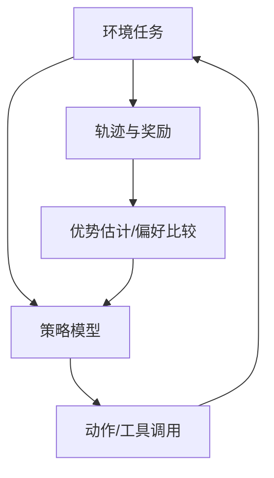

# 第 11 章：Agentic-RL

## 学习状态

- 状态：🆕 未学习；`achieve` 没有系统覆盖 Agent 轨迹训练。
- 原项目章节：Hello-Agents 第 11 章。
- 实践项目：[11-agentic-rl](../projects/11-agentic-rl/README.md)。

## 从 SFT 到策略优化

监督微调（SFT）用示范答案教模型“应该怎么答”；Agentic-RL 则把多步工具交互看成轨迹，根据最终任务结果、过程约束或人工偏好给奖励。轨迹可以表示为状态、动作、观察、奖励和终止标记。奖励设计决定模型学到什么：只奖励最终答案可能鼓励走捷径，只奖励过程可能让模型机械地增加步骤。

GRPO 等方法会在同一问题上比较多条采样轨迹，利用相对奖励更新策略；具体算法、损失函数和训练框架要以当前论文及官方实现为准。生产 Agent 仍应先用规则和评测保证安全，再讨论训练。奖励模型可能被钻空子（reward hacking），工具副作用和数据泄漏也会污染训练。

## 实践与验收

Demo 不训练大模型，而是用一个小策略在算术环境中采样轨迹、计算奖励和比较策略。实验：分别奖励“正确答案”“最少步骤”“合法工具调用”；构造一个会刷奖励但任务失败的策略；分析信用分配。验收：能区分 SFT、偏好优化和 RL，并能写出一个不鼓励危险捷径的奖励函数。
