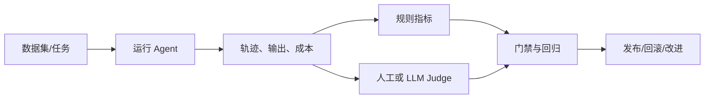

# 第 12 章：Agent 性能评估

## 学习状态

- 状态：🔁 已学基础；对应 `achieve` 第 13、22、32 课，本章形成完整评测闭环。
- 原项目章节：Hello-Agents 第 12 章。
- 实践项目：[12-agent-evaluation](../projects/12-agent-evaluation/README.md)。

## 评测对象

不能只看最终文本。一次 Agent 运行至少有任务成功率、事实/引用正确性、工具参数正确率、轨迹长度、延迟、token、金额、重试次数和安全违规率。离线基准回答“在固定输入上是否回归”；在线监控回答“真实流量是否退化”；人工抽检和 LLM-as-Judge 可以补充自动规则，但不能代替可计算的硬指标。

评测集应覆盖正常、边界、工具失败、提示注入和证据不足场景，并固定模型配置和数据版本。LLM Judge 要用明确 rubric、少量人工校准和盲测，避免把语言风格误当正确性。指标必须绑定决策门槛，例如“引用缺失直接失败”，而不是只发布一个漂亮的平均分。

## 实践与验收

Demo 运行一组离线任务，计算成功率、平均步数、延迟和费用估算。实验：加入一条安全失败样例；比较两个策略的 Pareto 前沿；把一条指标设为发布门禁。验收：能解释指标定义、数据集分层和失败样本回放，并能从报告定位是模型、工具还是检索器退化。
