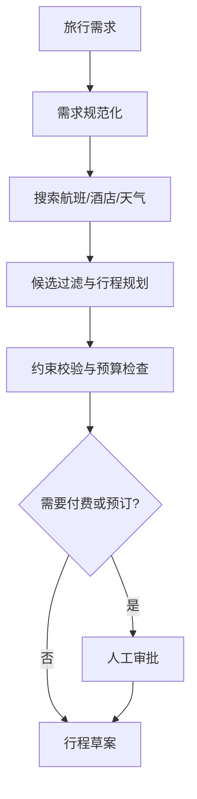

# 第 13 章：智能旅行助手

## 学习状态

- 状态：🆕 未学习；`achieve` 没有旅行场景的完整综合案例。
- 原项目章节：Hello-Agents 第 13 章。
- 实践项目：[13-travel-assistant](../projects/13-travel-assistant/README.md)。

## 三层实现标准

- 概念层：理解旅行需求结构化、候选过滤、预算/日期/天气约束和预订审批。
- 最小实践层：用固定航班、酒店和天气数据生成预算内的候选行程。
- 工程实现层：接入可替换的航班/酒店/天气工具，处理时区、币种、库存过期、隐私、幂等预订、人工审批和失败恢复，并为关键约束写测试。

当前 Demo 只验证规划规则，工程层才涉及真实外部副作用。

## 场景建模

旅行助手不是“问模型一段攻略”，而是把预算、日期、出发地、偏好、同行人和硬性约束转成可检查的计划。航班、酒店、天气和地图是外部工具；路线规划是纯函数或规划 Agent；下单、付款和发送邀请是高风险动作，必须审批。价格和库存随时间变化，所以结果应带时间戳和来源。

关键是把“建议”和“执行”分层。模型可以解释偏好和生成备选，但不能仅凭自然语言决定付款。隐私上要最小化护照、联系方式和同行人信息；工具结果要校验单位、时区、币种和过期时间。

## 实践与验收

Demo 使用固定航班、酒店和天气数据，生成预算内的两日计划。实验：新增预算硬约束；让天气工具失败并降级；加入预订前审批状态。验收：能追踪需求如何变成结构化状态，能指出每个工具的副作用和审批点，并能处理“没有满足全部约束的方案”。
