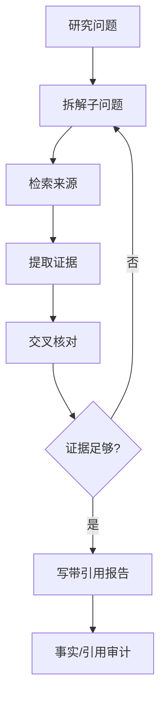

# 第 14 章：DeepResearch Agent

## 学习状态

- 状态：🔁 已学基础；对应 `achieve` 第 27～32 课，本章把已有研究助手扩展为可迭代研究系统。
- 原项目章节：Hello-Agents 第 14 章。
- 实践项目：[14-deep-research](../projects/14-deep-research/README.md)。

## 三层实现标准

- 概念层：理解问题拆解、来源发现、证据提取、矛盾核对、缺口分析和带引用写作。
- 最小实践层：用本地资料库演示来源、证据、结论和引用链。
- 工程实现层：实现可替换检索器、来源去重、证据 schema、引用审计、多轮预算、检查点恢复、抓取失败降级和报告回归测试；不把搜索摘要直接当证据。

当前 Demo 是本地证据链，工程层才是可恢复、可评测的研究系统。

## 研究闭环

DeepResearch 的核心不是一次搜索，而是问题拆解、来源发现、证据提取、矛盾核对、缺口分析、继续搜索和带引用写作。每条结论都应能回到来源片段；来源有发布时间、作者、URL 和可信度，不能把搜索摘要直接当原文。

要给研究设置预算：最大轮数、来源数量、token、金额和时间。搜索工具、浏览器工具和抓取器都可能遇到重复、动态页面、恶意内容和版权边界。状态中应分开保存 query、source、evidence、claim 和 citation，方便恢复和审计；报告生成器不应自行编造引用。

## 实践与验收

Demo 用本地资料库完成两轮检索和引用报告。实验：加入来源去重；制造互相矛盾的证据并要求报告标注不确定性；中断后从检查点恢复。验收：能画出研究状态图，能区分来源、证据和结论，并能用一个反例证明“有引用”不等于“引用支持结论”。
