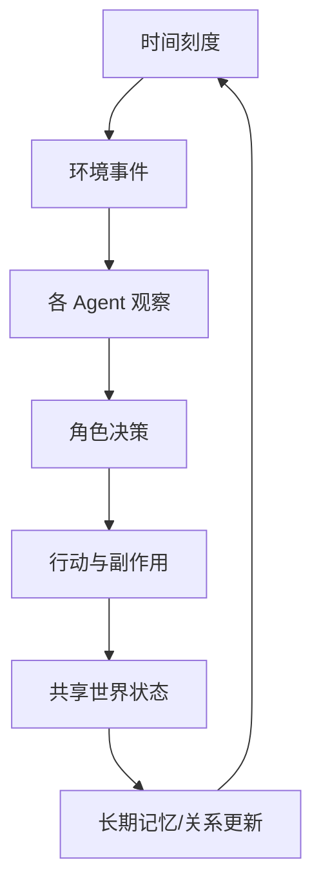

# 第 15 章：赛博小镇 Agent

## 学习状态

- 状态：🆕 未学习；`achieve` 没有 Agent 社会模拟课程。
- 原项目章节：Hello-Agents 第 15 章。
- 实践项目：[15-cyber-town](../projects/15-cyber-town/README.md)。

## 社会模拟模型

赛博小镇把多个 Agent 放进共享环境：每个角色有身份、目标、关系、记忆和可用行动；环境按时间推进并广播事件。Agent 的行为可能改变其他角色看到的状态，从而产生合作、冲突和意外结果。模拟的重点是可重复的状态转移，不是让模型自由聊天。

需要区分私有记忆、公开事实和不可见变量，防止所有 Agent 直接读取上帝视角。随机性应有 seed；事件和行动要记录；经济、身份、隐私和安全规则应由环境强制，而不是只写在 prompt 中。规模扩大后要控制模型调用，简单 NPC 可以用规则策略。

## 实践与验收

Demo 运行三个角色的一轮交易与对话，输出每个 tick 的世界状态。实验：新增一个冲突规则；固定 seed 重放同一局；比较全 LLM 角色和规则角色的成本。验收：能说明观察和世界状态的边界，能定位一次涌现行为是由哪条规则、记忆或消息导致的。
