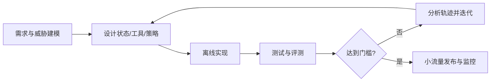

# 第 16 章：毕业设计

## 学习状态

- 状态：🔁 已学基础，继续综合；对应 `achieve` 第 27～32 课，但新项目必须独立选题和实现。
- 原项目章节：Hello-Agents 第 16 章。
- 实践项目：[16-graduation-project](../projects/16-graduation-project/README.md)。

## 三层实现标准

- 概念层：完成需求、状态、工具、策略、威胁模型、成功标准和发布边界设计。
- 最小实践层：完成一个离线可运行的端到端流程，覆盖正常、失败和边界样例。
- 工程实现层：完成真实模型/工具适配、持久化和恢复、权限与审批、观测与成本、评测门禁、部署说明和安全检查，形成可交付项目。

毕业设计必须展示三层之间的演进，不能只提交一个调用 LLM 的脚本。

## 交付目标

毕业项目不是把所有 Agent 技术都堆在一起，而是完成一个可解释、可运行、可评测的闭环应用。建议范围包括研究助手、旅行规划、企业知识助手或模拟环境。必须写清用户、任务、成功标准、数据边界和不能做什么；至少包含一个模型适配器、一个工具、一个状态流转、一个失败路径和一个离线评测集。

推荐分阶段：先做确定性工作流，再加入一个真正需要模型判断的节点；先做离线工具，再接真实服务；先记录轨迹，再优化 prompt 和模型。安全、成本、延迟和可恢复性应与功能一起验收。所有外部凭证只从环境读取，项目文档和测试中不得出现真实密钥。

## 验收清单

- 能用一页图解释状态、节点、工具、记忆和终止条件；
- 离线 Demo 可重复运行，至少有正常、失败、边界三类样例；
- 关键输出有结构化 schema，外部副作用有审批或幂等保护；
- 有任务成功率、成本、延迟和安全指标，并保存失败轨迹；
- 能说明哪些能力来自 `achieve` 的回顾，哪些是 Hello-Agents 新增；
- README 包含安装、运行、配置、限制、测试和后续改进。

提交前做一次“删掉 LLM 还能否测试”的检查：核心业务规则应尽量能在离线环境验证，真实模型只是可替换的决策组件。
